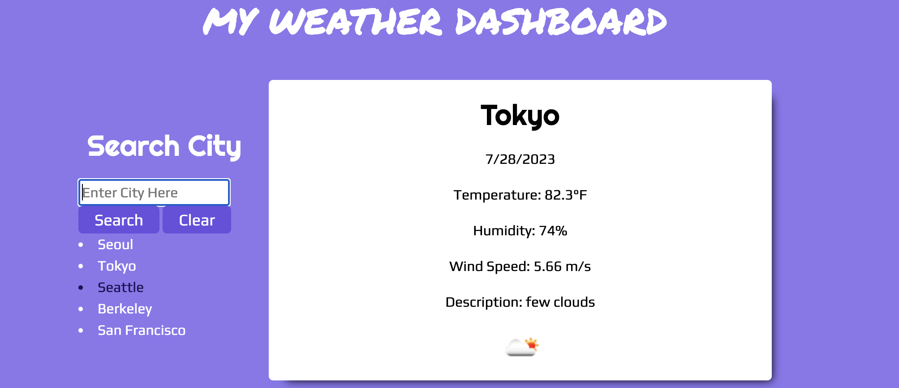
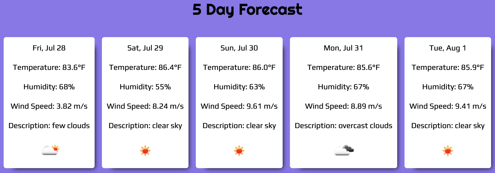

# Weather Dashboard

## Description:
* This application allows users to search weather condition and the following 5 day forecast of any City.
* This weather dashboard retrieves weather data from the OpenWeatherMap One Call API 3.0.

## Installation:
* On a web browser please follow the link to begin exploring. [Weather Dashboard.](https://junel-balbin.github.io/BC6-Weather-Dashboard/)
* Accessible on any mobile device and tablet.

## Usage:
* Input search any City you are interested.
* Search result will give you current weather.
* 5 Day forecast will also be displayed.
* Search history will be listed for selection.

## Application User Interface:

## Credits & Resources:
* Bard & ChatGpt for troubleshooting.
* Stack Overflow, MDN & w3schools.
* Google search & Youtube videos.
* EdX and UCB.

## Coded With:
* HTML, CSS & JavaScript.
* OpenWeatherMap API.
* Visual Studio Code.
* Font Awesome.
* Google fonts.
* Bootstrap.
* JQuery.
* Dayjs.

## Contributing:
* Any ideas or feedback is very much appreciated.

## License:
* MIT License.